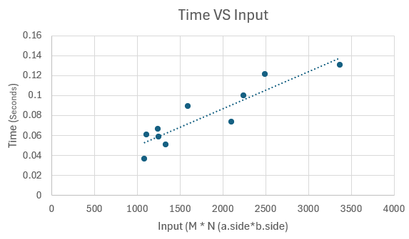

# Programming Assignment 3 – Highest Value Longest Common Sequence

## Course & Authors
* **Course:** COP 4533 – Algorithm Abstraction and Design (University of Florida)
* **Team Members:**
    * Hung Hong (UFID: 56253262)
    * Thyssen Nicholas (UFID: 19705329)

**Contributions**
Hung Hong: DP_Solver, Questions 2 and 3
Thyssen Nicholas: main, generator, Question 1


## Overview
- Highest Value Longest Common Subsequence (HVLCS)
- Given 2 strings + value for each character
- Find subsequence with maximum total value

## Core Tasks
- Parse input (K, values, A, B)
- Compute DP table
- Get max value
- Reconstruct subsequence
- Print result

## Algorithm
- DP (similar to LCS but weighted)
- Handle match vs skip

## Experiments
- 10+ test cases
- Strings length ≥ 25
- Measure runtime
- Plot graph

## Written
- Recurrence + base case
- Explain correctness
- Pseudocode
- Time complexity

## Files
- Example input/output
- Test inputs


intented profile file setup
Project file
```
│
├── src/     
│   ├── main.cpp
│   ├── generate_input.cpp
│   └── dp_solver.cpp
│
├── data/               # Input/output files
│   ├── example.in
│   ├── example.out
│   ├── input[#].in
│   ├── output[#].txt
│   └── ...
│
├── experiments/       # Data from Exeriments
│   ├── runtimes.csv
│   ├── Hong_Original_Write_Up.png # Original work for question 2
│   ├── OverLeaf_Algo DP_P3_Q2.png # Recur Equation
│   ├── runtimes.csv
│   └── graph.png
│
└── README.md


```

# How to run
To run all the inputs and create the graph data use the following code in the project folder directory in the terminal:

```
cd src
g++ main.cpp -o main
./main
```

# Question 1:

input1.in trough input10.in are all non trivial input files that we randomly generated. These files varied in input size, by having different alphabet lengths, lengths of A and lengths of B. We were able to use the main to solve these input files and get their running times for each in respect to length of A * length of B.



The above graph shows that the run time of the algorithm should be O(M*N) as the graph is linear, where M is the size of string A, and N is the size of string B.

# Question 2: 
Recurrence equation:


The recurrence defines OPT(i,j) as maximum value of a common subsequence between the first i characters of string A and the first j characters of string B.

- Base case: If either string is empty, the value is 0.
- Case 1: If A[i] = B[j], we consider including the character or skipping from either string.
- Case 2: If A[i] ≠ B[j], we skip one character from either string.

This ensure that all possible choices are considered before and while avoiding recompute through dynamic programming

### Why our recurrence is correct
This recurrence works because the problem has optimal substructure, meaning we can build the optimal solution from smaller subproblems.

- Base case: If either string is empty, then there is no common subsequence, so the value is 0.
- Case 1: If `A[i] = B[j]`, then we have a choice:
  - we can include this character in our subsequence, which adds `v(A[i])` plus the best result from the smaller problem `OPT(i-1, j-1)`, or  
  - we can skip one of the characters and rely on previous results (`OPT(i-1, j)` or `OPT(i, j-1)`).


- Case 2: If `A[i] ≠ B[j]`, , then we cannot match these two characters, so we must skip one of them: 
  - `A[i]` → `OPT(i-1, j)`  
  or
  - `B[j]` → `OPT(i, j-1)`

Since these cases cover all possible valid choices, and each choice reduces to smaller subproblems, taking the maximum ensures we always get the best possible value. Hence it should be `OPT`

# Question 3:
